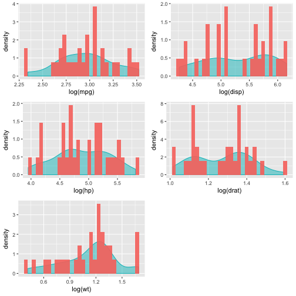
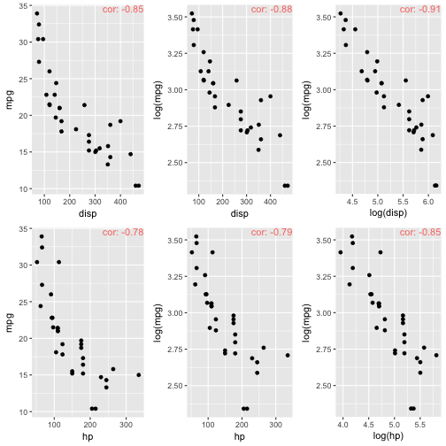
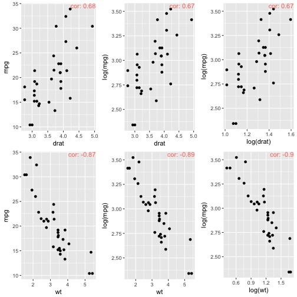
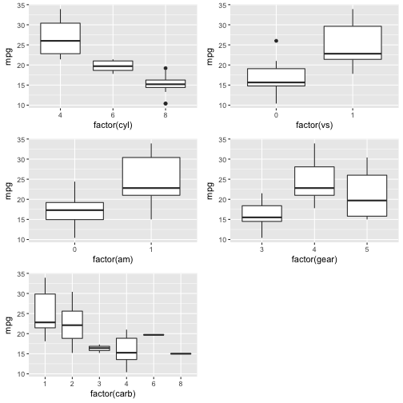

#Predicting Fuel Efficiency of Automobiles {.title}

## {.new}

###### 11/12/2016 

### Background

The 1974 issue of Motor Trend US magazine contained a data-set on the fuel consumption and ten different aspects of design and performance for 32 automobiles. The goal of this project is to create a prediction model for figuring out an automobile's fuel efficiency, or how many miles per gallon (mpg) the automobile gets.

### First

We should take a look at the data. No need to load the data-set into the global environment, as R already has it. We'll use the function `str()` to get an overview of the data.


```r
str(mtcars)
```

```
## 'data.frame':	32 obs. of  11 variables:
##  $ mpg : num  21 21 22.8 21.4 18.7 18.1 14.3 24.4 22.8 19.2 ...
##  $ cyl : num  6 6 4 6 8 6 8 4 4 6 ...
##  $ disp: num  160 160 108 258 360 ...
##  $ hp  : num  110 110 93 110 175 105 245 62 95 123 ...
##  $ drat: num  3.9 3.9 3.85 3.08 3.15 2.76 3.21 3.69 3.92 3.92 ...
##  $ wt  : num  2.62 2.88 2.32 3.21 3.44 ...
##  $ qsec: num  16.5 17 18.6 19.4 17 ...
##  $ vs  : num  0 0 1 1 0 1 0 1 1 1 ...
##  $ am  : Factor w/ 2 levels "0","1": 2 2 2 1 1 1 1 1 1 1 ...
##  $ gear: num  4 4 4 3 3 3 3 4 4 4 ...
##  $ carb: num  4 4 1 1 2 1 4 2 2 4 ...
```

We can see that all of the variables in the data-set are numeric. Transmission should be a category, though: 0 marks automatic, and 1 marks manual. We'll need to fix this. We also don't see the names of the automobiles. This is because they are the row names of the data-set. Let's take a look at this as well.


```r
mtcars$am <- factor(mtcars$am)
rownames(mtcars)
```

```
##  [1] "Mazda RX4"           "Mazda RX4 Wag"       "Datsun 710"         
##  [4] "Hornet 4 Drive"      "Hornet Sportabout"   "Valiant"            
##  [7] "Duster 360"          "Merc 240D"           "Merc 230"           
## [10] "Merc 280"            "Merc 280C"           "Merc 450SE"         
## [13] "Merc 450SL"          "Merc 450SLC"         "Cadillac Fleetwood" 
## [16] "Lincoln Continental" "Chrysler Imperial"   "Fiat 128"           
## [19] "Honda Civic"         "Toyota Corolla"      "Toyota Corona"      
## [22] "Dodge Challenger"    "AMC Javelin"         "Camaro Z28"         
## [25] "Pontiac Firebird"    "Fiat X1-9"           "Porsche 914-2"      
## [28] "Lotus Europa"        "Ford Pantera L"      "Ferrari Dino"       
## [31] "Maserati Bora"       "Volvo 142E"
```

### Exploritory Visualization

Lets take a look at some of the quantitative variables with density plots overlaid with histograms to get an idea of the distributions.


Here we can see that most of the variables are right skew. Displacement and rear axle ratio are distinctively bi-modal. The other variables are closer to being uni-modal. We should also take note that there are outliers in each variable. It may be a good idea to look at the natural logarithm of some of these variables. This will help bring in the outliers and alter the distributions.



The distributions for miles per gallon and horsepower are much more evenly skewed. Weight is now skewed further to the left than originally. Displacement's distribution is now reversed, and the rear axle ratio has barely changed.

Now it's time to look at how each variable affects miles per gallon. We'll start with simple scatter plots and the associated correlation coefficient. The correlation coefficient is used to represent the linear dependence of two variables. The number can lie within the range of negative one to one. A negative one would indicate a perfect negative relationship, a zero indicates no correlation, and a positive one is a perfect positive relationship. The correlation coefficient is calculated by dividing the covariance of the two variables by the product of standard deviations of the variables. The equation is: $\text{r} = \frac{cov(A,B)}{ \left( S_A \cdot S_B \right)}$





From the charts here we see that when the natural logarithm of a variable is used the correlation is strengthened. The exception is with the rear axle ratio, where the results become worse by applying the natural logarithm. This shouldn't be surprising; we saw little change in the distribution of the rear axle ratio when a natural logarithm was applied as well.

It is now time to explore how miles per gallon interacts with categorical variables. We'll use box-plots for this exploration.



These box-plots make it really easy to understand the trends of the explanatory variables verses miles per gallons. As cylinders increase, miles per gallon decreases. We see that automobiles with straight engines or that have manual transmissions usually get better miles per gallon than automobiles with V engines or that have automatic transmissions. Now that we have a good understanding of how miles per gallon interacts with the explanatory variables on simple singular levels, lets start to combine them.

### Multiple Regression

We're going to use multiple linear regression for our predictive model. This model is defined as: $\text{Y} = \textit{b}_0 + \textit{b}_1 \cdot \textit{X}_{i1} + \textit{b}_2 \cdot \textit{X}_{i2} + \cdots + \textit{b}_{p} \textit{X}_{ip} + \epsilon_{i}$ where $\text{b}_0$ is the intercept and $\textit{b}_1$, $\textit{b}_2$, and so on are the slopes for each variable. R is great at creating linear regression models with ease. We'll simply use the `lm()` function and the calculations are done for us. Calling a summary, the model shows the intercept and the slopes. It also tells us the residual standard error, degrees of freedom, and the multiple R-squared value. For our first model we're going to add all of the variables in it as is. Next we will use the `predict()` function with the model on the original data-set. Then we'll figure out the mean squared difference between the predicted outcomes and the actual miles per gallon observations (the error). This number is how we'll gauge the effectiveness of our model. The rule of thumb is the smaller the mean squared error is, the better the model.


```r
model_1 <- lm(mpg ~ cyl + disp + hp + drat + wt + vs + am + gear + carb, data = mtcars)
summary(model_1)
```

```
## 
## Call:
## lm(formula = mpg ~ cyl + disp + hp + drat + wt + vs + am + gear + 
##     carb, data = mtcars)
## 
## Residuals:
##     Min      1Q  Median      3Q     Max 
## -3.9116 -1.5674 -0.2339  1.4742  5.2483 
## 
## Coefficients:
##              Estimate Std. Error t value Pr(>|t|)  
## (Intercept) 28.514875  11.992102   2.378   0.0265 *
## cyl         -0.433807   1.010821  -0.429   0.6720  
## disp         0.007608   0.017216   0.442   0.6629  
## hp          -0.024133   0.021769  -1.109   0.2796  
## drat         0.720339   1.643997   0.438   0.6655  
## wt          -2.636203   1.642528  -1.605   0.1228  
## vs           1.181162   1.970789   0.599   0.5551  
## am1          1.887310   1.989726   0.949   0.3532  
## gear         0.519607   1.497197   0.347   0.7318  
## carb        -0.449539   0.803027  -0.560   0.5813  
## ---
## Signif. codes:  0 '***' 0.001 '**' 0.01 '*' 0.05 '.' 0.1 ' ' 1
## 
## Residual standard error: 2.666 on 22 degrees of freedom
## Multiple R-squared:  0.8611,	Adjusted R-squared:  0.8043 
## F-statistic: 15.16 on 9 and 22 DF,  p-value: 1.658e-07
```

```r
prediction_1 <- predict(model_1, newdata = mtcars)
pred_diff_1 <- with(mtcars, mpg - prediction_1)
mean(pred_diff_1 ^ 2)
```

```
## [1] 4.886205
```

We see that this gives us a mean squared error of 4.89. Recall from our exploratory visualizations that taking the natural logarithm of the explanatory variable improved the correlation coefficient. Let's now edit our model to use the natural logarithms of the previous explanatory variables.


```r
model_2 <- lm(mpg ~ cyl + log(disp) + log(hp) + drat + log(wt) + vs + am + gear + carb, data = mtcars)
summary(model_2)
```

```
## 
## Call:
## lm(formula = mpg ~ cyl + log(disp) + log(hp) + drat + log(wt) + 
##     vs + am + gear + carb, data = mtcars)
## 
## Residuals:
##     Min      1Q  Median      3Q     Max 
## -2.9151 -1.4789 -0.4502  1.0758  3.9896 
## 
## Coefficients:
##             Estimate Std. Error t value Pr(>|t|)    
## (Intercept)  56.5512    13.6472   4.144 0.000425 ***
## cyl           0.6350     0.9085   0.699 0.491940    
## log(disp)    -2.9726     3.4723  -0.856 0.401177    
## log(hp)      -4.1365     2.7291  -1.516 0.143835    
## drat         -0.0978     1.4309  -0.068 0.946130    
## log(wt)      -6.7490     4.1206  -1.638 0.115669    
## vs            0.2723     1.6655   0.163 0.871626    
## am1           0.2604     1.8225   0.143 0.887684    
## gear          1.3659     1.3240   1.032 0.313456    
## carb         -0.6489     0.6014  -1.079 0.292271    
## ---
## Signif. codes:  0 '***' 0.001 '**' 0.01 '*' 0.05 '.' 0.1 ' ' 1
## 
## Residual standard error: 2.285 on 22 degrees of freedom
## Multiple R-squared:  0.898,	Adjusted R-squared:  0.8562 
## F-statistic: 21.51 on 9 and 22 DF,  p-value: 6.38e-09
```

```r
prediction_2 <- predict(model_2, newdata = mtcars)
pred_diff_2 <- with(mtcars, mpg - prediction_2)
mean(pred_diff_2 ^ 2)
```

```
## [1] 3.590276
```

Here we see that our model has improved. Our mean squared error drops to 3.59. Could we improve this model further? Next, let's try to take the interaction among a few of our variables.


```r
model_3 <- lm(mpg ~ cyl + log(disp) * log(hp) * log(wt) * drat + vs + am + gear + carb, data = mtcars)
summary(model_3)
```

```
## 
## Call:
## lm(formula = mpg ~ cyl + log(disp) * log(hp) * log(wt) * drat + 
##     vs + am + gear + carb, data = mtcars)
## 
## Residuals:
##     Min      1Q  Median      3Q     Max 
## -2.2846 -0.5429  0.1042  0.6782  2.5353 
## 
## Coefficients:
##                                  Estimate Std. Error t value Pr(>|t|)
## (Intercept)                     2.820e+02  3.284e+03   0.086    0.933
## cyl                            -1.917e+00  1.843e+00  -1.041    0.320
## log(disp)                       1.611e+02  7.672e+02   0.210    0.838
## log(hp)                        -2.244e+02  5.931e+02  -0.378    0.712
## log(wt)                        -3.376e+03  3.715e+03  -0.909    0.383
## drat                           -4.382e+01  8.129e+02  -0.054    0.958
## vs                             -5.705e-02  2.553e+00  -0.022    0.983
## am1                             1.387e+00  2.438e+00   0.569    0.581
## gear                            9.303e-02  2.221e+00   0.042    0.967
## carb                            7.606e-01  1.154e+00   0.659    0.523
## log(disp):log(hp)               1.762e+00  1.378e+02   0.013    0.990
## log(disp):log(wt)               4.152e+02  7.677e+02   0.541    0.599
## log(hp):log(wt)                 8.292e+02  6.994e+02   1.186    0.261
## log(disp):drat                 -5.429e+01  1.924e+02  -0.282    0.783
## log(hp):drat                    6.235e+01  1.485e+02   0.420    0.683
## log(wt):drat                    8.941e+02  9.566e+02   0.935    0.370
## log(disp):log(hp):log(wt)      -1.128e+02  1.423e+02  -0.792    0.445
## log(disp):log(hp):drat          4.344e-01  3.464e+01   0.013    0.990
## log(disp):log(wt):drat         -1.016e+02  1.962e+02  -0.518    0.615
## log(hp):log(wt):drat           -2.286e+02  1.832e+02  -1.248    0.238
## log(disp):log(hp):log(wt):drat  2.985e+01  3.678e+01   0.812    0.434
## 
## Residual standard error: 1.938 on 11 degrees of freedom
## Multiple R-squared:  0.9633,	Adjusted R-squared:  0.8966 
## F-statistic: 14.43 on 20 and 11 DF,  p-value: 3.082e-05
```

```r
prediction_3 <- predict(model_3, newdata = mtcars)
pred_diff_3 <- with(mtcars, mpg - prediction_3)
mean(pred_diff_3 ^ 2)
```

```
## [1] 1.291573
```

Our mean squared error has shrunk even more. This seems great, but we should note a few things. As we progress in decreasing the mean squared error with each new model, we have also decreased the degrees of freedom, and have increased the multiple R-squared value making models that have very tight fits. We should realize that because of this tight fit we could possibly be over-fitting the models. Over-fitting the models will not allow them to scale and perform well on new sets of data.

### Conclusion

We have created a model that predicts an automobile's fuel efficiency. We should understand the model's limits though. The model may not work well with the introduction of new data due to its tight fit. We should also take into account that the data-set represents a sample of cars from 1973-1974. Cars have become more fuel efficient over the years, so this model may work poorly at predicting the fuel efficiency of, say, a Toyota Prius. A model made from a much larger and more unbiased sample would be more accurate.


#### Project Source Code

https://github.com/PunkFood-Disme/MotorTrend_Project
